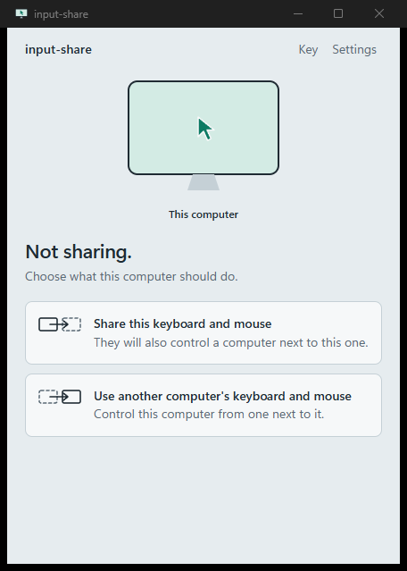
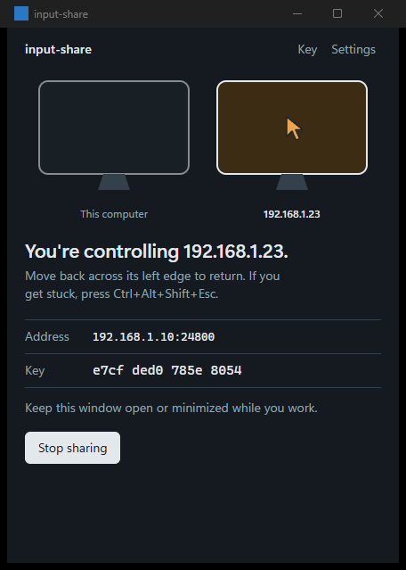
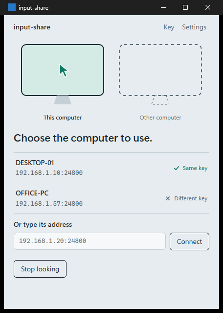

# input-share

Share one keyboard and mouse between two Windows computers on the same
network. Push the pointer off the edge of your desktop's screen and it appears
on your laptop, with the keyboard following it. Push it back and control
returns.

It is a small software KVM switch, in the spirit of Synergy or Barrier:
Windows to Windows, one sharing computer and one computer being controlled,
encrypted end to end, with a tray app on top.

<p>
  
  
  
</p>

## What it does

- **Crossing:** the pointer moves between the two screens at the edge you
  choose, landing at the same relative height. Layouts with several monitors
  of different sizes are handled monitor by monitor.
- **Clipboard:** text and images you copy on one computer can be pasted on
  the other once the pointer crosses, with formatting (bold, links, tables)
  when copied from a browser, Word or Outlook. Only what you copied since
  the session started crosses, so crossing back never replaces the other
  computer's clipboard with stale contents. Up to 100 MB: a big image
  arrives a moment after the pointer, without holding it up. Past 100 MB
  only the plain text is sent, if it fits.
- **Encrypted and paired:** every keystroke travels encrypted (Noise
  `NNpsk0` with a 256-bit shared key). A computer without your key cannot
  read or send input.
- **Finds the other computer:** the sharing computer announces itself on the
  local network; the other one lists it, marked "Same key" when the keys
  match.
- **Tray app:** closing the window while sharing or connected keeps it in
  the tray. The tray icon shows which screen has control.
- **Safety rails:** a panic hotkey, automatic return of control when the
  connection drops, and release of held keys and buttons so nothing sticks.

## Requirements

- Windows 10 or 11 on both computers, on the same local network.
- To build: a current stable Rust with the MSVC toolchain (developed with
  1.94; the code needs at least 1.88 for edition 2024 let-chains).
- The GUI uses WebView2, which ships with Windows 11 and current Windows 10.

## Build

```
cargo build --release
```

This builds both programs into `target\release\`:

| Program | What it is |
|---|---|
| `input-share-gui.exe` | The tray app. Most people want this one. |
| `input-share.exe` | A command-line version of the same thing. |

Copy the same program to the other computer. Nothing needs installing.

## Use it (GUI)

1. **Make a key** on one computer: open **Key**, then **Make a new key**, then
   **Show key file**. Copy that `key.hex` to the other computer (a USB stick,
   or any channel you trust), and on that computer use **Key**, then
   **Import**.
2. **Compare fingerprints:** both computers show the key as four groups of
   four characters on the Key page. They must match.
3. **Set the side:** in **Settings**, say where the other computer is, from
   the sharing computer's point of view. Use the same answer on both.
4. **Share:** on the computer with the keyboard and mouse, choose **Share this
   keyboard and mouse**. The first time, Windows Firewall asks for access:
   allow it on **Private** networks only. Both computers' networks must be
   set to Private too (see [Network and security](#network-and-security)).
5. **Connect:** on the other computer, choose **Use another computer's
   keyboard and mouse** and pick the sharing computer from the list (or type
   the address it shows).
6. Push the pointer off the chosen edge. Push it back to return.

Settings are locked while a session is running; stop it first to change them.
The key and settings live in `%APPDATA%\input-share\`.

### Getting your input back

While control is on the other computer, the sharing computer's own keyboard
and mouse are redirected. Any of these returns them:

- **Ctrl+Alt+Shift+Esc** on the sharing computer (the panic hotkey).
- Quit the app on the other computer, using its own touchpad or keyboard.
  The sharing computer takes control back within about 3 seconds.
- **Ctrl+Alt+Del**, then Task Manager, then end the program. Windows removes
  the input hooks when it exits.

While control is away, the sharing computer's pointer is hidden. If it ever
stays hidden after a crash, open input-share again (it restores the pointer
on startup), or sign out and back in.

## Use it (command line)

```
input-share keygen [--key key.hex]
input-share server [--bind 0.0.0.0:24800] [--key key.hex] [--edge right|left]
input-share client HOST[:PORT] [--key key.hex] [--edge right|left]
```

`--edge` is the sharing computer's edge that leads to the other computer
(default `right`); give both ends the same value.

For trying things out without touching the real mouse and keyboard:

- `server --script FILE --screen WxH` feeds scripted input instead of the
  real keyboard and mouse (see `core/src/server.rs` for the script format).
- `client ... --dry-run --screen WxH` prints what it would inject instead of
  injecting it.
- `input-share-gui --demo` runs the GUI entirely on this computer, with fake
  peers, no input hooks and no injection. Its key and settings go to a temp
  folder.

## Network and security

| Port | Protocol | Used for |
|---|---|---|
| 24800 | TCP | The encrypted session, and a second connection for each big clipboard (changeable in Settings or with `--bind`) |
| 24801 | UDP | Discovery beacons (broadcast on the local network) |

- The session uses Noise `NNpsk0_25519_ChaChaPoly_BLAKE2s`. Without the shared
  key the handshake fails and the connection closes.
- **Keep `key.hex` private.** Anyone with it who can reach your computer can
  connect and read or send input. It never leaves your machines unless you
  copy it.
- Discovery beacons carry the port, the computer's name and a short
  fingerprint of the key. The fingerprint does not reveal the key. Beacons are
  only a convenience for finding the address; they are never trusted for
  anything else.
- Allow the firewall prompts on **Private** networks only, and set your home
  network to **Private** on both computers: Settings, Network & internet,
  Wi-Fi (or Ethernet), the network's properties, **Network profile type**.
  On a network marked Public, Windows blocks everything coming in, so that
  computer cannot see other computers that are sharing, and nothing can
  connect to it when it shares. It can still connect out to a typed address.
  To check: `Get-NetConnectionProfile` in PowerShell.

## Known limits

These come from Windows, not from bugs:

- Input cannot reach windows running as administrator unless the receiving
  side also runs as administrator.
- The lock screen, Ctrl+Alt+Del and UAC prompts are on a secure desktop that
  no program can inject into.
- One computer controlled at a time. The clipboard shares text, formatting
  and images, not files, and there is no file drag yet.

## Development

```
cargo test --workspace
cargo clippy --workspace --all-targets -- -D warnings
```

The tests never touch the real keyboard or mouse: networking runs on
127.0.0.1, and the end-to-end test drives a scripted server and a dry-run
client.

| Path | Contents |
|---|---|
| `core/` | The library: protocol, encryption, monitor layout, discovery, input hooks and injection |
| `cli/` | The `input-share` command-line program and the end-to-end test |
| `gui/` | The Tauri tray app: Rust commands in `gui/src/`, the interface in `gui/ui/` (plain HTML, CSS and JS) |
| `tools/` | Scripts that draw the icons and take the GUI screenshots in `docs/gui/` |

`tools/shots.ps1` screenshots every GUI state in light and dark theme (demo
mode only). `tools/make_app_icon.py` and `tools/make_tray_icons.py` redraw the
icons.

## License

MIT. See [LICENSE](LICENSE).
